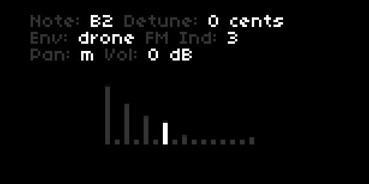

# Sines

A simple FM sine drone synth with 16 independant sine waves. Each sine wave is FM modulated with configurable carrier - modulator FM index.

Control sine amplitudes with norns or a midi controller (hardcoded for 16n midi cc's).

## Installation

Ensure you are up to date with the latest norns OS.

To install sines, visit norns.local in a browser, and enter the following in the maiden REPL:

	norns.fetch("https://github.com/aidanreilly/sines")

Then, `SYSTEM => RESET` on norns to pick up the new SuperCollider engine.

## Play

Select a root note and scale from the norns parameters menu. 16 frequencies based on the selected scale are applied. You can also tune the sine waves by hand on norns.  

Controls:

* [E1] master volume
* [E2] select sine 1-16
* [E3] set sine amplitude
* [K1] exit to norns main menu
* [K2] + [E2] change note
* [K2] + [E3] detune
* [K3] + [E2] change envelope
* [K3] + [E3] change FM index
* [K2] + [K3] set voice pannning. 'm' centers all voices in the stereo field, 'l/r' pans odd numbered voices hard left, and even numbered voices hard right. 

### Optional

Control individual sine wave amplitudes with 16n or other midi controller, on midi cc's 32-47, channel 1.

