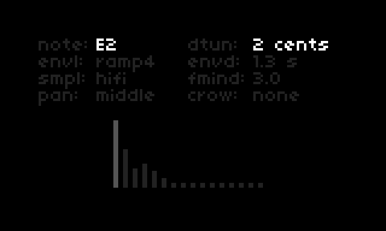

# Sines

A simple FM sine drone synth with 16 independant sine waves. Each sine wave is FM modulated with configurable carrier - modulator FM index. Sample rate and bit depth can be changed for each voice.

## Installation

Ensure you are up to date with the latest norns OS. Visit http://norns.local/ in a browser, and install sines from the maiden project manager.

Then, `SYSTEM => RESET` on norns to pick up the new SuperCollider engine. Reboot for good measure.

## Play

Select a root note and scale from the norns parameters menu. 16 frequencies based on the selected scale are applied. You can also tune the sine waves by hand on norns. 

Controls:

* [E1] master volume
* [E2] select sine 1-16
* [E3] set sine amplitude
* [K1] exit to norns main menu
* [K2] + [E2] change note
* [K2] + [E3] detune
* [K3] + [E2] change envelope
* [K3] + [E3] change FM index
* [K1] + [E2] - change sample rate
* [K1] + [E3] - change bit depth
* [K2] + [K3] set voice pannning. 'm' centers all voices in the stereo field, 'l/r' pans odd numbered voices hard left, and even numbered voices hard right. 

Saving a pset saves the note selection and midi mapping. The last saved pset is loaded when the app launches.

### Optional

Control individual sine amplitude, envelope type, bit depth, sample rate, and FM index with a midi controller. Controls are mapped from the norns parameters page.

